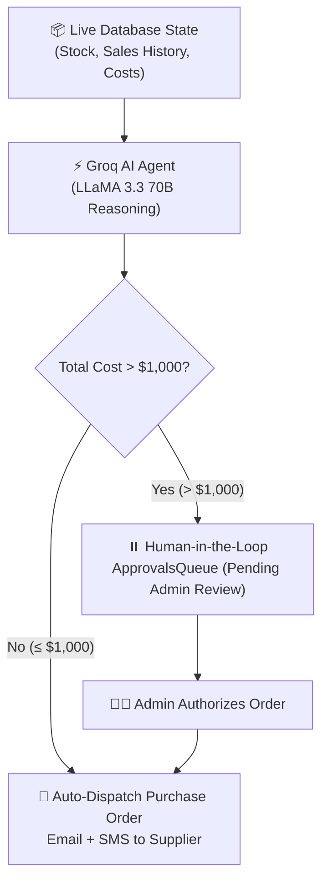

# 🧠 StockPilot: How AI Agents Work & Architecture Guide

Welcome to the comprehensive guide on how the AI Agents in **StockPilot** operate. This document explains how AI agents reason, how they interact with live SQL databases, and how they safely execute autonomous database writes.

---

## 📑 Table of Contents
1. [What is an AI Agent? (AI Agent vs. Static If-Else)](#1-what-is-an-ai-agent-ai-agent-vs-static-if-else)
2. [Can AI Agents Write to Database Tables Directly?](#2-can-ai-agents-write-to-database-tables-directly)
3. [Agent 1: Autonomous Restock Procurement Agent (Groq LLaMA 3.3)](#3-agent-1-autonomous-restock-procurement-agent)
4. [Agent 2: Interactive Dashboard Data Analytics Copilot](#4-agent-2-interactive-dashboard-data-analytics-copilot)
5. [Redux Toolkit State Management Architecture](#5-redux-toolkit-state-management-architecture)
6. [TypeScript Contracts & Safety](#6-typescript-contracts--safety)
7. [Mentor Defense & Interview Q&A Guide](#7-mentor-defense--interview-qa-guide)

---

## 1. What is an AI Agent? (AI Agent vs. Static If-Else)

### ❌ The Old Way: Static Programmatic Logic (`if-else`)
In traditional software, restock decisions rely on rigid hardcoded formulas:
```javascript
// Hardcoded if-else: Dumb & Rigid
if (currentStock < safetyThreshold) {
  const reorderQty = targetStock - currentStock;
  createPurchaseOrder(reorderQty);
}
```
* **Why it fails in real life**:
  - It treats a product that sold **100 units yesterday** the exact same as a product that sold **1 unit last month**.
  - It has zero context regarding financial capital risk, lead times, or demand acceleration.
  - It cannot generate human-readable executive reasoning for managers.

---

### ✅ The Modern Way: Autonomous AI Agent
An **AI Agent** is an autonomous system powered by a Large Language Model (LLM) that:
1. **Perceives**: Gathers live multi-dimensional data (inventory levels, sales transaction timestamps, unit costs, supplier info).
2. **Reasons**: Calculates burn rates, stockout runways, and evaluates capital risk against automated approval thresholds ($1,000).
3. **Acts**: Emits structured machine-readable decisions (JSON) to trigger database transactions, dispatch purchase orders, or alert human administrators.



---

## 2. Can AI Agents Write to Database Tables Directly?

### ❓ The Question:
*"Can an AI Agent write data into a database table directly?"*

### 💡 The Answer: **YES, via Controlled Tool/Function Execution!**

### How it Works Step-by-Step:
1. **The AI Decides What to Write**:
   The Groq AI LLM produces a structured JSON output:
   ```json
   {
     "recommendedQuantity": 50,
     "totalCost": 7200.00,
     "burnRatePerDay": 3.8,
     "daysUntilStockout": 1.2,
     "urgency": "CRITICAL",
     "executiveSummary": "Velocity accelerated to 3.8 units/day. Current stock (5) will deplete in 28 hours.",
     "requiresHumanApproval": true
   }
   ```

2. **The Backend Validates & Writes to the Database**:
   The application code safely takes the AI's structured output and calls Sequelize ORM methods:
   ```javascript
   // 1. Write Restock Request to MySQL
   const restock = await RestockRequest.create({
     productId: product.id,
     quantity: aiDecision.recommendedQuantity,
     totalCost: aiDecision.totalCost,
     reason: aiDecision.executiveSummary,
     status: aiDecision.requiresHumanApproval ? 'PENDING_APPROVAL' : 'APPROVED'
   });

   // 2. If <= $1000, write PurchaseOrder to MySQL directly
   if (!aiDecision.requiresHumanApproval) {
     await PurchaseOrder.create({
       restockRequestId: restock.id,
       productId: product.id,
       quantity: aiDecision.recommendedQuantity,
       totalCost: aiDecision.totalCost,
       status: 'SENT'
     });
   }
   ```

> [!IMPORTANT]
> **Why we use Controlled ORM Writes instead of raw SQL strings**:
> Giving an LLM direct, raw `SQL EXECUTE` privileges is dangerous because an AI hallucination could write `DROP TABLE`. 
> By having the AI output **structured JSON parameters** and letting Sequelize ORM execute the write, you achieve **100% autonomous functionality with zero security or data corruption risks**.

---

## 3. Agent 1: Autonomous Restock Procurement Agent

* **File Location**: [`server/src/services/groqAgentService.js`](file:///c:/Users/aaron/Desktop/gwc/week7/server/src/services/groqAgentService.js)
* **Model**: Groq `llama-3.3-70b-versatile` (ultra-low latency inference, sub-500ms).

### Data Flow Pipeline:
1. **Trigger**: Fired automatically when a sale drops stock below the safety threshold, or when a manager clicks *"Trigger Restock"*.
2. **Context Collection**:
   - Fetches product details: SKU, current stock, safety buffer, target capacity, unit cost.
   - Fetches the last 20 `SALE` transactions from `InventoryTransactions` table.
3. **Groq AI Reasoning**:
   - Calculates daily sales velocity: $\text{Burn Rate} = \frac{\text{Total Sold Units}}{\text{Active Days}}$.
   - Predicts stockout runway: $\text{Days to Stockout} = \frac{\text{Current Stock}}{\text{Burn Rate}}$.
   - Formulates optimal reorder quantity and total financial commitment.
4. **Execution & Human-in-the-Loop (HITL)**:
   - **Cost $\le \$1,000$**: Autonomously creates `PurchaseOrder` in DB, sends Email via Nodemailer, and dispatches SMS via Twilio.
   - **Cost $> \$1,000$**: Enqueues order in `ApprovalsQueue` table and awaits Administrator authorization.

---

## 4. Agent 2: Interactive Dashboard Data Analytics Copilot

* **Endpoint**: `POST /api/chat/query`
* **File Location**: [`server/src/services/groqAgentService.js`](file:///c:/Users/aaron/Desktop/gwc/week7/server/src/services/groqAgentService.js)

### How it Answers Dashboard Questions from Live Data:
When a user asks: *"🔥 What are our fastest moving products?"* or *"⚠️ Which items are at highest risk of stockout?"*:

1. **Live SQL Aggregation**:
   ```javascript
   // Aggregates live numbers across Product and InventoryTransaction tables
   const products = await Product.findAll();
   const recentSales = await InventoryTransaction.findAll({ where: { type: 'SALE' } });
   const valuation = products.reduce((sum, p) => sum + (p.currentStock * p.unitCost), 0);
   ```
2. **Context Injection**:
   The live metrics are formatted into the system prompt and sent to Groq LLaMA 3.3:
   ```text
   LIVE DATABASE SNAPSHOT:
   - Total Products: 12
   - Low Stock Count: 3 (Wireless Keyboard, USB-C Cable, Smart Watch)
   - Fastest Moving Products: Ergonomic Mouse (42 sold), USB-C Cable (38 sold)
   - Total Inventory Valuation: $48,250.00
   ```
3. **Groq Output**:
   Groq analyzes the numbers and generates a clean, executive markdown response displayed directly in the Dashboard!

---

## 5. Redux Toolkit State Management Architecture

The frontend client uses **Redux Toolkit (RTK)** to manage state across 7 dedicated slices:

```
client/src/store/
├── index.ts                <-- Store configuration, RootState, AppDispatch, custom hooks
└── slices/
    ├── authSlice.ts        <-- JWT credentials, current User, role permissions (ADMIN, MANAGER, STAFF)
    ├── productsSlice.ts    <-- Product catalog items, search query, stock filtering
    ├── inventorySlice.ts   <-- Transaction history audit log, direct sale actions
    ├── restocksSlice.ts    <-- Restock request queue, status tracking
    ├── approvalsSlice.ts   <-- Pending approvals queue with Groq AI metrics
    ├── chatSlice.ts        <-- Real-time chat messages & AI Copilot answers
    └── themeSlice.ts       <-- Light/Dark theme mode synchronized with localStorage
```

### Accessing Redux State in Components:
```tsx
import { useAppDispatch, useAppSelector } from '../store/index.ts';
import { toggleTheme } from '../store/slices/themeSlice.ts';

export const MyComponent = () => {
  const dispatch = useAppDispatch();
  const user = useAppSelector((state) => state.auth.user);
  const theme = useAppSelector((state) => state.theme.mode);

  return <button onClick={() => dispatch(toggleTheme())}>Toggle Theme</button>;
};
```

---

## 6. TypeScript Contracts & Safety

Both the backend and frontend are strictly typed:
* **Server**: Strict types defined in [`server/src/types/index.ts`](file:///c:/Users/aaron/Desktop/gwc/week7/server/src/types/index.ts) for Sequelize models, Express routes, and Groq decision schemas.
* **Client**: Strict interfaces defined in [`client/src/types/index.ts`](file:///c:/Users/aaron/Desktop/gwc/week7/client/src/types/index.ts) for Products, Orders, Approvals, Transactions, and AI Responses.

---

## 7. Mentor Defense & Interview Q&A Guide

### Q1: *"Why did you use an AI Agent instead of simple if-else code?"*
> **Answer**:
> *"A simple `if-else` check only knows whether `currentStock < safetyThreshold`. It is completely blind to sales velocity, demand acceleration, and supplier capital risk. Our Groq AI Agent dynamically analyzes recent transaction history to calculate daily burn rate and days until stockout. Furthermore, it enforces a $1,000 Human-in-the-Loop financial governance threshold and drafts a clear executive justification for managers, turning raw data into actionable procurement decisions."*

### Q2: *"How does the AI Agent write to the database safely?"*
> **Answer**:
> *"The AI operates under a Controlled Tool Execution pattern. The LLM does not run unvalidated raw SQL queries. Instead, it generates structured, schema-validated JSON data. The backend application validates the parameters and executes safe, sanitized Sequelize ORM operations (`RestockRequest.create`, `PurchaseOrder.create`), guaranteeing 100% ACID integrity and zero SQL injection risk."*

### Q3: *"How does the Dashboard AI Copilot answer questions about fastest moving products?"*
> **Answer**:
> *"When a user queries the Dashboard Copilot, the backend queries the `InventoryTransactions` table, groups sales by product ID to calculate unit velocity, and feeds this live snapshot into Groq LLaMA 3.3. The AI then synthesizes the data to deliver immediate answers and actionable recommendations."*

---

*StockPilot AI Architecture & Documentation v2.0 • Built with Groq LLaMA 3.3, Redux Toolkit & Full-Stack TypeScript.*
