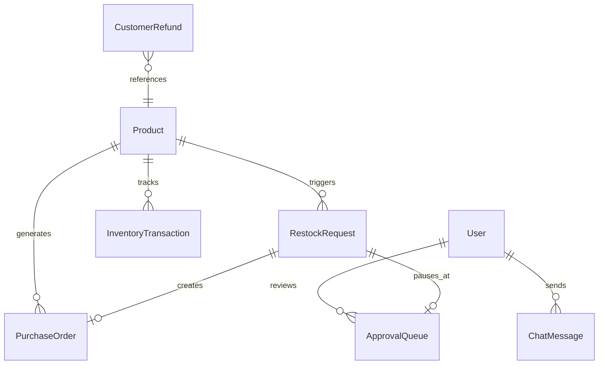
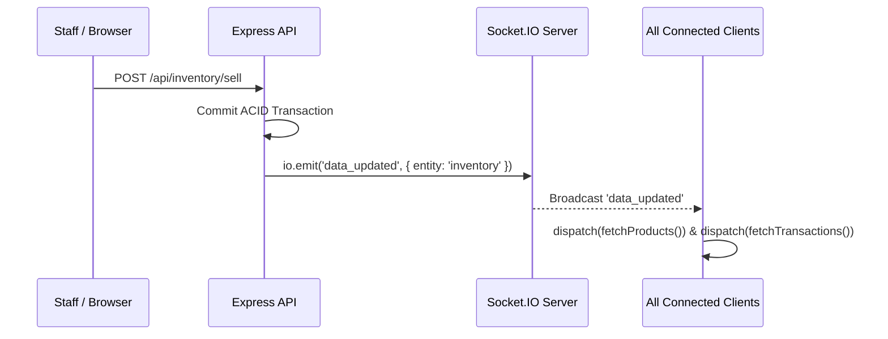

# 📘 StockPilot – Complete Master Project Documentation

> **Intelligent Autonomous Inventory Restock, Multi-Agent Procurement, & Operations Intelligence System**
> 
> *A unified, production-grade enterprise platform combining deterministic mathematical supply chain computation with semantic Groq Large Language Model intelligence, Human-in-the-Loop (HITL) executive boundaries, and centralized Redux Toolkit state synchronization.*

---

## 📑 Table of Contents
1. [Executive Summary & System Overview](#1-executive-summary--system-overview)
2. [High-Level Architecture & Data Flow](#2-high-level-architecture--data-flow)
3. [Technology Stack](#3-technology-stack)
4. [Database Schema & ACID Transactional Integrity](#4-database-schema--acid-transactional-integrity)
5. [Autonomous AI Agents Suite](#5-autonomous-ai-agents-suite)
6. [Complete REST API Specification (42 Endpoints)](#6-complete-rest-api-specification-42-endpoints)
7. [Real-Time WebSocket Architecture (Socket.IO)](#7-real-time-websocket-architecture-socketio)
8. [Role-Based Access Control (RBAC) & Security](#8-role-based-access-control-rbac--security)
9. [Frontend Architecture & Redux Toolkit (Async Thunks)](#9-frontend-architecture--redux-toolkit-async-thunks)
10. [Multi-Channel Notification Infrastructure](#10-multi-channel-notification-infrastructure)
11. [Environment Variables Reference](#11-environment-variables-reference)
12. [Installation, Seeding & Local Development](#12-installation-seeding--local-development)
13. [Testing, Swagger & Postman Guide](#13-testing-swagger--postman-guide)
14. [Production Cloud Deployment](#14-production-cloud-deployment)

---

## 1. Executive Summary & System Overview

### 1.1 The Business Problem
Modern multi-channel warehouses face severe operational friction:
1. **Stockout Blindspots**: Manual reordering often happens *after* products run out, creating revenue loss and customer churn.
2. **Slow, Inconsistent Claim Processing**: Customer support teams spend days manually reviewing return claims, applying inconsistent criteria and writing boilerplate responses.
3. **High-Value Procurement Risk**: Autonomous systems that issue orders without checks can cause catastrophic financial overruns if algorithms hallucinate or fail.
4. **Vendor Quotation Friction**: Evaluating competitive RFPs involves manually reading 20-page vendor PDF quotes, comparing inconsistent unit tiers, MOQs, warranty terms, and defect SLAs.

### 1.2 The StockPilot Solution
StockPilot solves these challenges by combining **deterministic mathematical computation** for speed and predictability with **semantic AI agents** for complex reasoning:
* **Zero-Latency Restock Engine**: High-velocity arithmetic computes sales burn rates, days until stockout, and economic order quantities in microseconds.
* **Human-in-the-Loop (HITL) Safeguards**: Orders $\le \$1,000$ are auto-approved and dispatched; orders $> \$1,000$ automatically pause in `PENDING_APPROVAL` with email alerts for executive review.
* **Autonomous Refund Claims Agent**: Evaluates return requests against store policies, auto-approving low-risk claims ($\le \$150$) and generating personalized customer email drafts.
* **Vendor RFP Quotation Intelligence**: Extracts text from multiple supplier PDF quotes using `pdf-parse` and prompts Groq LLMs to produce structured comparison matrices, recommendation scores, and award notifications.
* **Operations Copilot**: Natural language assistant querying live database telemetry to give instant inventory insights via a custom client-side Markdown rendering engine.

---

## 2. High-Level Architecture & Data Flow

```text
┌─────────────────────────────────────────────────────────────────────────────┐
│                       REACT 18 + VITE + TAILWIND FRONTEND                   │
│  • Redux Toolkit 2.x (createAsyncThunk)     • Animated Recharts (Bar/Area/Pie)│
│  • Socket.IO Real-time Sync                 • Operations AI Copilot         │
│  • Responsive Dark Mode UI                  • Custom Markdown-to-JSX Engine │
└──────────────────────────────────────┬──────────────────────────────────────┘
                                       │ REST API (Axios Interceptors) / WSS
                                       ▼
┌─────────────────────────────────────────────────────────────────────────────┐
│                          EXPRESS.JS BACKEND ENGINE                          │
│  ┌─────────────────────────┬─────────────────────────┬────────────────────┐ │
│  │ Dual-Token JWT & RBAC   │ Zod Schema Validation   │ WebSockets Server  │ │
│  ├─────────────────────────┼─────────────────────────┼────────────────────┤ │
│  │ 42 Modular REST Routes  │ Multer & pdf-parse      │ Swagger OpenAPI UI │ │
│  └─────────────────────────┴─────────────────────────┴────────────────────┘ │
└──────────────────────────────────────┬──────────────────────────────────────┘
                                       │
        ┌──────────────────────────────┼──────────────────────────────┐
        ▼                              ▼                              ▼
┌────────────────┐             ┌────────────────┐             ┌────────────────┐
│ DATABASE LAYER │             │ AI AGENTS SUITE│             │ NOTIFICATIONS  │
├────────────────┤             ├────────────────┤             ├────────────────┤
│ • SQLite (Dev) │             │ • Groq Cloud   │             │ • Brevo REST   │
│ • MySQL (Prod) │             │   LLaMA 3.3 70B│             │   API (443)    │
│ • Sequelize ORM│             │ • Refund Agent │             │ • Nodemailer   │
│ • ACID Atomic  │             │ • Vendor Agent │             │   SMTP Relay   │
│   Transactions │             │ • Copilot LLM  │             │ • Twilio SMS   │
└────────────────┘             └────────────────┘             └────────────────┘
```

---

## 3. Technology Stack

| Layer | Technologies | Key Packages & Versions |
| :--- | :--- | :--- |
| **Frontend UI** | React 18, TypeScript, Tailwind CSS, Vite | `react` (18.3), `react-dom` (18.3), `tailwindcss` (3.4), `vite` (5.4) |
| **State Management** | Redux Toolkit, React-Redux | `@reduxjs/toolkit` (2.12), `react-redux` (9.3) |
| **Data Visualization** | Recharts, Lucide Icons | `recharts` (3.10), `lucide-react` (0.474) |
| **HTTP & Networking** | Axios, Socket.IO Client | `axios` (1.7), `socket.io-client` (4.8) |
| **Backend Framework** | Node.js, Express.js | `express` (4.21), `cors` (2.8), `cookie-parser` (1.4), `dotenv` (16.4) |
| **Database & ORM** | Sequelize, MySQL, SQLite | `sequelize` (6.37), `mysql2` (3.12), `sqlite3` (5.1) |
| **AI Reasoning Engine** | Groq Cloud SDK, LangGraph | `groq-sdk` (1.5), `@langchain/langgraph` (0.2), `@langchain/core` (0.3) |
| **Authentication & RBAC** | JWT, Bcrypt | `jsonwebtoken` (9.0), `bcryptjs` (2.4), `zod` (3.24) |
| **File Processing** | Multer, PDF Parse, PDF Lib, Cloudinary | `multer` (1.4), `pdf-parse` (2.4), `pdf-lib` (1.17), `cloudinary` (2.10) |
| **Notification Gateway** | Brevo HTTPS API, Nodemailer, Twilio | `nodemailer` (6.10), `twilio` (6.1) |
| **API Documentation** | Swagger UI Express, OpenAPI 3.0 | `swagger-ui-express` (5.0), `swagger-jsdoc` (6.2) |

---

## 4. Database Schema & ACID Transactional Integrity

StockPilot supports both **SQLite** (local zero-setup development) and **MySQL** (production) via Sequelize ORM.

### 4.1 ACID Transactional Integrity
Stock movements execute inside atomic database transactions (`sequelize.transaction()`). If any operation fails, the entire transaction rolls back automatically:
```javascript
// Example: Atomic POS Sale Transaction
const t = await sequelize.transaction();
try {
  const product = await Product.findByPk(productId, { transaction: t, lock: true });
  if (product.currentStock < quantity) throw new Error('Insufficient inventory');

  const previousStock = product.currentStock;
  const newStock = previousStock - quantity;

  await product.update({ currentStock: newStock }, { transaction: t });
  await InventoryTransaction.create({
    productId,
    type: 'SALE',
    quantity,
    previousStock,
    newStock,
    referenceId
  }, { transaction: t });

  await t.commit(); // Atomically commits both changes
} catch (err) {
  await t.rollback(); // Zero data corruption
}
```

### 4.2 Core Models & Entity Relationships



* **`User`**: `id`, `name`, `email`, `password` (bcrypt hash), `role` (`ADMIN`, `MANAGER`, `STAFF`).
* **`Product`**: `id`, `name`, `sku` (unique), `description`, `currentStock`, `safetyThreshold`, `targetStock`, `unitCost`, `supplierName`, `supplierEmail`, `supplierPhone`, `image`.
* **`InventoryTransaction`**: `id`, `productId`, `type` (`SALE`, `RESTOCK`, `ADJUSTMENT`), `quantity`, `previousStock`, `newStock`, `referenceId`, `notes`, `createdAt`.
* **`RestockRequest`**: `id`, `productId`, `quantity`, `totalCost`, `status` (`PENDING`, `APPROVED`, `REJECTED`, `ORDERED`, `COMPLETED`), `requiresHumanReview`, `urgencyScore`, `daysUntilStockout`.
* **`PurchaseOrder`**: `id`, `productId`, `supplierName`, `supplierEmail`, `supplierPhone`, `quantity`, `unitCost`, `totalCost`, `status` (`PENDING`, `SENT`, `FULFILLED`, `CANCELLED`).
* **`ApprovalQueue`**: `id`, `threadId` (unique workflow key), `productId`, `quantity`, `totalCost`, `reason`, `status` (`PENDING`, `APPROVED`, `REJECTED`).
* **`ChatMessage`**: `id`, `senderId`, `message`, `createdAt`.
* **`AgentLog`**: `id`, `agentName`, `action`, `input`, `output`, `confidence`, `status`, `executionTimeMs`.
* **`CustomerRefund`**: `id`, `orderNumber`, `customerName`, `customerEmail`, `productId`, `amount`, `daysSincePurchase`, `reason`, `customerMessage`, `status`, `aiSuggestedDecision`, `aiConfidence`, `aiExplanation`, `aiEmailDraft`.
* **`VendorEvaluation`**: `id`, `title`, `productCategory`, `targetQuantity`, `priorityFocus`, `bestVendorName`, `bestVendorEmail`, `bestVendorPhone`, `overallRecommendationScore`, `scoringMatrix`, `executiveSummary`, `keyTradeoffs`, `riskAnalysis`, `negotiationStrategy`, `emailDraft`, `smsDraft`.

---

## 5. Autonomous AI Agents Suite

StockPilot deploys 4 specialized autonomous agent pipelines powered by **Groq Cloud (LLaMA 3.3 70B / Qwen 2.5)**:

```
┌─────────────────────────────────────────────────────────────────────────────┐
│                         STOCKPILOT AI AGENTS SUITE                          │
└──────────────────────────────────────┬──────────────────────────────────────┘
                                       │
        ┌──────────────────────────────┼──────────────────────────────┐
        ▼                              ▼                              ▼
┌────────────────┐             ┌────────────────┐             ┌────────────────┐
│ RESTOCK & HITL │             │ REFUND CLAIMS  │             │ VENDOR RFP     │
│ REPLENISHMENT  │             │ REASONING AI   │             │ QUOTATIONS AI  │
├────────────────┤             ├────────────────┤             ├────────────────┤
│ • Velocity Math│             │ • Policy Rules │             │ • PDF Parser   │
│ • Burn Rates   │             │ • Sentiment    │             │ • 5-Factor     │
│ • $1,000 Limit │             │ • Auto-refunds │             │   Matrix       │
│ • PO Dispatch  │             │ • Email Drafts │             │ • Email/SMS    │
└────────────────┘             └────────────────┘             └────────────────┘
```

### 5.1 Agent 1: Autonomous Restock & Human-in-the-Loop Agent
* **Trigger**: Automatic when sales reduce stock below `safetyThreshold` or manual trigger via `POST /api/restocks/trigger`.
* **Deterministic Calculation**:
  $$\text{Reorder Quantity} = \text{Target Stock} - \text{Current Stock}$$
  $$\text{Total Cost} = \text{Reorder Quantity} \times \text{Unit Cost}$$
* **Safety Boundary Enforcement**:
  * **If Total Cost $\le \$1,000$**: System immediately creates `PurchaseOrder` in `SENT` status and dispatches automated supplier email via Brevo/Nodemailer.
  * **If Total Cost $> \$1,000$**: System pauses execution, records state in `ApprovalQueue` as `PENDING`, and triggers real-time WebSocket signals for Administrator sign-off.

### 5.2 Agent 2: Operations & Inventory Analytics Copilot
* **Endpoint**: `POST /api/chat/query`
* **Workflow**: Injects current database counts, total inventory valuation, low stock lists, and recent transaction volume into the system prompt.
* **Output**: Structured markdown with tables, headers, and bullet points parsed on the frontend via [`FormattedAiResponse.tsx`](file:///c:/Users/aaron/Desktop/gwc/week7/client/src/components/FormattedAiResponse.tsx).

### 5.3 Agent 3: Customer Service & Refund Processing Agent
* **Endpoint**: `POST /api/refunds/process`
* **Reasoning**: Analyzes purchase date, return window (30 days), item condition, and emotional context.
* **Auto-Approval**: Claims $\le \$150$ with valid conditions are immediately marked `APPROVED`.
* **Human Escalation**: High-value ($> \$150$) or borderline claims pause in `PENDING_APPROVAL` with an AI confidence score, bulleted explanation, and a ready-to-send customer email draft.

### 5.4 Agent 4: Vendor RFP & Quotation Intelligence Agent
* **Endpoint**: `POST /api/vendor-evaluations/evaluate`
* **Extraction**: Ingests up to 20 uploaded vendor quotation documents (PDF/TXT/CSV) using `pdf-parse`.
* **Multi-Factor Scoring Matrix**: Evaluates pricing, minimum order quantities (MOQ), lead time, warranty duration, defect rate SLAs, and ISO quality certifications.
* **Output**: Executive summary, key tradeoffs, negotiation strategy, and pre-composed award email and Twilio SMS notification drafts.

---

## 6. Complete REST API Specification (42 Endpoints)

### 6.1 Authentication (`/api/auth`)
| Method | Endpoint | Access | Description |
| :--- | :--- | :---: | :--- |
| `POST` | `/api/auth/login` | Public | Authenticates credentials; returns JWT access token & sets HttpOnly refresh cookie |
| `POST` | `/api/auth/refresh` | Public | Exchanges HttpOnly refresh cookie for a new 15-minute access token |
| `POST` | `/api/auth/logout` | Authenticated | Invalidate refresh tokens and clear client session cookies |

### 6.2 Products (`/api/products`)
| Method | Endpoint | Access | Description |
| :--- | :--- | :---: | :--- |
| `GET` | `/api/products` | All Users | List all products with calculated stock health status |
| `GET` | `/api/products/:id` | All Users | Retrieve single product details & historical transactions |
| `POST` | `/api/products` | `ADMIN`, `MANAGER` | Create new product catalog item |
| `PUT` | `/api/products/:id` | `ADMIN`, `MANAGER` | Update pricing, safety threshold, and target stock |
| `DELETE` | `/api/products/:id` | `ADMIN` | Permanently delete product from catalog |
| `POST` | `/api/products/:id/image` | `ADMIN`, `MANAGER` | Upload product image to Cloudinary via Multer multipart |

### 6.3 Inventory Movements (`/api/inventory`)
| Method | Endpoint | Access | Description |
| :--- | :--- | :---: | :--- |
| `POST` | `/api/inventory/sell` | All Users | Record customer sale, atomically decrement stock, and log audit trail |
| `POST` | `/api/inventory/adjust` | `ADMIN`, `MANAGER` | Manual stock count adjustments with audit rationale |
| `GET` | `/api/inventory/transactions`| All Users | Query historical ACID audit trail (`?limit=50`) |

### 6.4 Restocks & Replenishment (`/api/restocks`)
| Method | Endpoint | Access | Description |
| :--- | :--- | :---: | :--- |
| `GET` | `/api/restocks` | All Users | List all autonomous restock requests |
| `GET` | `/api/restocks/:id` | All Users | Retrieve single restock request details |
| `POST` | `/api/restocks/trigger` | `ADMIN`, `MANAGER` | Run deterministic restock calculation engine on product ID |
| `POST` | `/api/restocks/:id/retry` | `ADMIN`, `MANAGER` | Re-evaluate rejected or failed restock request |
| `POST` | `/api/restocks/:id/receive`| `ADMIN`, `MANAGER` | Receive delivered stock into warehouse via atomic ACID transaction |

### 6.5 Executive Approvals Queue (`/api/approvals`)
| Method | Endpoint | Access | Description |
| :--- | :--- | :---: | :--- |
| `GET` | `/api/approvals` | `ADMIN`, `MANAGER` | Query pending restock orders exceeding $1,000 threshold |
| `POST` | `/api/approvals/approve` | `ADMIN`, `MANAGER` | Authorize high-value PO, dispatch supplier email & update state |
| `POST` | `/api/approve-restock` | `ADMIN`, `MANAGER` | Canonical route alias for submitting approval decisions |
| `DELETE` | `/api/approvals/:id` | `ADMIN`, `MANAGER` | Cancel approval request and dismiss pending replenishment |

### 6.6 Purchase Orders (`/api/purchase-orders`)
| Method | Endpoint | Access | Description |
| :--- | :--- | :---: | :--- |
| `GET` | `/api/purchase-orders` | All Users | List all formal supplier purchase orders generated by the system |
| `GET` | `/api/purchase-orders/:id` | All Users | Retrieve single purchase order record with line items |

### 6.7 Agent Audit Logs (`/api/agent-logs`)
| Method | Endpoint | Access | Description |
| :--- | :--- | :---: | :--- |
| `GET` | `/api/agent-logs` | All Users | Query real-time autonomous agent decision logs and traces (`?limit=50`) |

### 6.8 Operations Chat & Copilot (`/api/chat`)
| Method | Endpoint | Access | Description |
| :--- | :--- | :---: | :--- |
| `GET` | `/api/chat/messages` | All Users | Retrieve real-time warehouse communication stream (`?limit=100`) |
| `POST` | `/api/chat/messages` | All Users | Send message and broadcast to active staff via WebSockets |
| `POST` | `/api/chat/query` | All Users | Query Operations Analytics AI Copilot for natural language insights |

### 6.9 User Management (`/api/users`)
| Method | Endpoint | Access | Description |
| :--- | :--- | :---: | :--- |
| `GET` | `/api/users/profile` | All Users | Retrieve current user profile and permission roles |
| `GET` | `/api/users` | `ADMIN`, `MANAGER` | List all user accounts in the enterprise system |
| `POST` | `/api/users` | `ADMIN`, `MANAGER` | Create new staff or manager user account |

### 6.10 Customer Refunds AI Agent (`/api/refunds`)
| Method | Endpoint | Access | Description |
| :--- | :--- | :---: | :--- |
| `POST` | `/api/refunds/process` | All Users | Run Groq AI reasoning agent on customer refund claims |
| `GET` | `/api/refunds` | All Users | List all refund claims and AI evaluation states |
| `POST` | `/api/refunds/:id/decide` | `ADMIN`, `MANAGER` | Submit human override decision on escalated refund claims |
| `POST` | `/api/refunds/:id/send-email`| `ADMIN`, `MANAGER` | Dispatch customer notification email for a specific claim |
| `POST` | `/api/refunds/send-email` | `ADMIN`, `MANAGER` | Direct email dispatch route with custom customer body |

### 6.11 Vendor Quotation RFP Intelligence (`/api/vendor-evaluations`)
| Method | Endpoint | Access | Description |
| :--- | :--- | :---: | :--- |
| `GET` | `/api/vendor-evaluations/samples` | All Users | List pre-generated test sample vendor quotation PDFs |
| `POST` | `/api/vendor-evaluations/evaluate` | All Users | Upload up to 20 quote PDFs/TXT; runs extraction and LLM comparison |
| `POST` | `/api/vendor-evaluations/send-email`| All Users | Send official award email to selected supplier via Brevo/Nodemailer |
| `POST` | `/api/vendor-evaluations/send-sms` | All Users | Send SMS notification to winning vendor via Twilio |
| `GET` | `/api/vendor-evaluations` | All Users | List all historical multi-vendor RFP evaluations |
| `GET` | `/api/vendor-evaluations/:id` | All Users | Retrieve full evaluation matrix, scoring, and recommendation report |
| `DELETE` | `/api/vendor-evaluations/:id` | `ADMIN`, `MANAGER` | Remove historical evaluation record from archive |

---

## 7. Real-Time WebSocket Architecture (Socket.IO)

The backend runs Socket.IO concurrently on the primary HTTP port (`ws://localhost:5000` or production WSS).



### Events Specification
* **`send_message` (Client $\to$ Server)**: Carries `{ senderId: number, message: string }`. Saves to DB and broadcasts.
* **`chat_message` (Server $\to$ Client)**: Emits full message payload with sender info to all connected users.
* **`data_updated` (Server $\to$ Client)**: Emitted after any inventory change, restock creation, or approval decision. Triggers instant Redux async thunk refetch in the frontend without full-page reloads.
* **`vendor:evaluated` (Server $\to$ Client)**: Notifies clients when background multi-PDF quotation analysis completes.

---

## 8. Role-Based Access Control (RBAC) & Security

### 8.1 RBAC Permissions Matrix

| Feature / Resource | API Route | ADMIN | MANAGER | STAFF |
| :--- | :--- | :---: | :---: | :---: |
| **Authentication & Profile** | `/api/auth/*`, `/api/users/profile` | ✅ | ✅ | ✅ |
| **View Dashboard & Catalog** | `GET /api/products` | ✅ | ✅ | ✅ |
| **Create Catalog Items** | `POST /api/products` | ✅ | ✅ | ❌ |
| **Edit Catalog Items** | `PUT /api/products/:id` | ✅ | ✅ | ❌ |
| **Delete Catalog Items** | `DELETE /api/products/:id` | ✅ | ❌ | ❌ |
| **Upload Product Images** | `POST /api/products/:id/image` | ✅ | ✅ | ❌ |
| **Record Customer Sales** | `POST /api/inventory/sell` | ✅ | ✅ | ✅ |
| **Manual Stock Adjustments** | `POST /api/inventory/adjust` | ✅ | ✅ | ❌ |
| **View Inventory Audit Logs** | `GET /api/inventory/transactions` | ✅ | ✅ | ✅ |
| **Trigger Restock Engine** | `POST /api/restocks/trigger` | ✅ | ✅ | ❌ |
| **Approve/Reject HITL Orders**| `POST /api/approvals/approve` | ✅ | ✅ | ❌ |
| **Receive Stock Deliveries** | `POST /api/restocks/:id/receive` | ✅ | ✅ | ❌ |
| **Manage Users** | `GET / POST /api/users` | ✅ | ✅ | ❌ |
| **Override/Decide Refunds** | `POST /api/refunds/:id/decide` | ✅ | ✅ | ❌ |
| **Award Vendor Contracts** | `POST /api/vendor-evaluations/send-*` | ✅ | ✅ | ✅ |
| **Delete Vendor Evaluations**| `DELETE /api/vendor-evaluations/:id` | ✅ | ✅ | ❌ |

### 8.2 Security Guard Architecture
1. **Password Encryption**: Salt factor 10 using `bcryptjs`.
2. **Access Tokens**: Short-lived JWT (15 minutes) sent in `Authorization: Bearer <token>`.
3. **Refresh Tokens**: 7-day JWT stored in `HttpOnly`, `SameSite=Lax` cookies to prevent XSS token theft.
4. **Preflight CORS & ACAH**:
   ```javascript
   app.use(cors({
     origin: ['http://localhost:5173', 'http://127.0.0.1:5173', env.CLIENT_URL],
     credentials: true,
     allowedHeaders: ['Content-Type', 'Authorization', 'X-Requested-With', 'Accept']
   }));
   ```

---

## 9. Frontend Architecture & Redux Toolkit (Async Thunks)

### 9.1 Directory Layout
```text
client/src/
├── components/          # Reusable UI (Navbar, Sidebar, Badges, ProtectedRoute, FormattedAiResponse)
├── context/             # Global Contexts (AuthContext, SocketContext)
├── pages/               # Primary Views (Dashboard, Products, Inventory, RestockRequests, ...)
├── services/            # Central Axios API instance with auto-refresh interceptors (api.ts)
├── store/               # Redux Toolkit Store configuration and typed slices
│   ├── index.ts         # configureStore, RootState, AppDispatch, useAppDispatch, useAppSelector
│   └── slices/          # authSlice, productsSlice, inventorySlice, restocksSlice, approvalsSlice, chatSlice, themeSlice
├── javascript-reference/# Parallel Pure JavaScript reference implementation for education
└── utils/               # imageUrl.ts helper, date/currency formatters
```

### 9.2 Redux Async Thunks Architecture
Every backend API call is managed through Redux Toolkit `createAsyncThunk` actions, providing predictable `pending`, `fulfilled`, and `rejected` states:

```typescript
// Example: productsSlice.ts
export const fetchProducts = createAsyncThunk(
  'products/fetchProducts',
  async (_, { rejectWithValue }) => {
    try {
      const res = await api.get<ProductItem[]>('/products');
      return res.data;
    } catch (err: any) {
      return rejectWithValue(err.response?.data?.error || 'Failed to fetch products');
    }
  }
);
```

### 9.3 Client-Side Markdown Formatter ([`FormattedAiResponse.tsx`](file:///c:/Users/aaron/Desktop/gwc/week7/client/src/components/FormattedAiResponse.tsx))
Converts raw Groq LLM responses into structured React elements without insecure `dangerouslySetInnerHTML`:
* Tokenizes raw text into `heading`, `table`, `list`, `callout`, and `paragraph`.
* Formats tables into interactive dark-mode HTML tables with cell-level badges (surplus, currency, stock counts).

### 9.4 Image URL Resolver ([`imageUrl.ts`](file:///c:/Users/aaron/Desktop/gwc/week7/client/src/utils/imageUrl.ts))
Handles Cloudinary absolute URLs (`https://...`), Base64 previews (`data:`), and local relative paths (`/uploads/...`) by automatically prepending the backend server origin in development and production.

---

## 10. Multi-Channel Notification Infrastructure

StockPilot features a resilient, zero-timeout multi-channel notification subsystem:

```
                      [ Notification Request ]
                                 │
                 ┌───────────────┴───────────────┐
                 ▼                               ▼
       [ Email Dispatcher ]              [ SMS Dispatcher ]
                 │                               │
        ┌────────┴────────┐                      ▼
        ▼                 ▼                 [ Twilio SDK ]
 [ Brevo REST API ] [ Nodemailer ]          Instant SMS to
   (Port 443 HTTPS)   (SMTP Relay)           Suppliers & Execs
   *Bypasses cloud    *Local/Fallback
    firewalls*
```

* **Brevo HTTPS REST API (Port 443)**: Eliminates cloud firewall timeouts on outbound SMTP ports (587/465) common on Render, AWS EC2, and DigitalOcean.
* **Nodemailer Fallback**: Standard SMTP transport for local testing.
* **Twilio SMS Gateway**: Sends instant procurement alerts and emergency stockout notifications to mobile devices.

---

## 11. Environment Variables Reference

Create a `.env` file in the root and server directory:

```bash
# Server Configuration
PORT=5000
NODE_ENV=development
CLIENT_URL=http://localhost:5173

# Database Configuration
DB_DIALECT=sqlite # 'sqlite' or 'mysql'
DB_STORAGE=./database.sqlite # For SQLite
DB_HOST=localhost # For MySQL
DB_PORT=3306
DB_NAME=stockpilot
DB_USER=root
DB_PASSWORD=your_password

# JWT Security
JWT_ACCESS_SECRET=your_super_secret_access_key_12345
JWT_REFRESH_SECRET=your_super_secret_refresh_key_67890

# AI Reasoning Engine (Groq Cloud)
GROQ_API_KEY=gsk_your_groq_api_key

# Email Notifications (Brevo REST & SMTP)
BREVO_API_KEY=xkeysib-your_brevo_api_key
EMAIL_HOST=smtp-relay.brevo.com
EMAIL_PORT=587
EMAIL_USER=your_verified_email@domain.com
EMAIL_PASS=your_smtp_password
EMAIL_FROM="StockPilot Operations" <orders@stockpilot.io>

# SMS Notifications (Twilio)
TWILIO_ACCOUNT_SID=AC_your_twilio_account_sid
TWILIO_AUTH_TOKEN=your_twilio_auth_token
TWILIO_PHONE_NUMBER=+15550192800

# Cloudinary Storage (Optional Product Images)
CLOUDINARY_CLOUD_NAME=your_cloud_name
CLOUDINARY_API_KEY=your_cloudinary_key
CLOUDINARY_API_SECRET=your_cloudinary_secret
```

---

## 12. Installation, Seeding & Local Development

### 12.1 Installation
Install dependencies across root, server, and client in one command:
```bash
npm run install:all
```

### 12.2 Database Seeding
Populate the database with default enterprise users, catalog items, supplier contacts, and historical transactions:
```bash
npm run seed
```

**Default Seeded User Accounts:**
* **Administrator**: `admin@stockpilot.io` / `password123`
* **Procurement Manager**: `manager@stockpilot.io` / `password123`
* **Warehouse Staff**: `staff@stockpilot.io` / `password123`

### 12.3 Starting Local Development
Launch both Express backend (Port 5000) and Vite frontend (Port 5173) concurrently:
```bash
npm run dev
```

* **Frontend**: `http://localhost:5173`
* **Backend API**: `http://localhost:5000/api`
* **Swagger API Docs**: `http://localhost:5000/api-docs`

---

## 13. Testing, Swagger & Postman Guide

### 13.1 Swagger OpenAPI 3.0 Interactive Explorer
Visit `http://localhost:5000/api-docs` (or your cloud URL `/api-docs`):
1. Execute `POST /api/auth/login` with admin credentials.
2. Copy the `accessToken`.
3. Click the green **Authorize 🔓** button at the top right, paste the token, and click **Authorize**.
4. Test all 42 endpoints interactively directly from your browser!

### 13.2 Postman Automated Collection
Import [`postman/stockpilot.postman_collection.json`](file:///c:/Users/aaron/Desktop/gwc/week7/postman/stockpilot.postman_collection.json):
* Organized into **11 folders** covering all **42 endpoints**.
* Pre-configured with automatic token capture script on login.
* Toggle between `{{baseUrl}}` (local) and `{{deploymentUrl}}` (cloud).

### 13.3 Automated Typechecks & Verification
```bash
# Frontend TypeScript check
cd client && npx tsc --noEmit

# Production bundle test
npm run build
```

---

## 14. Production Cloud Deployment

### 14.1 Render / AWS / Cloud Setup
1. **Web Service Type**: Node.js Web Service.
2. **Build Command**: `npm run build`
3. **Start Command**: `node server/src/server.js`
4. **Environment Variables**: Add all keys from [Section 11](#11-environment-variables-reference). Ensure `NODE_ENV=production` and `DB_DIALECT=mysql` (or attach persistent disk for SQLite).
5. **Reverse Proxy Trust**: The backend includes `app.set('trust proxy', 1)` to handle secure HTTPS cookies behind Render/AWS reverse proxies.
6. **Live Production Documentation**: Swagger is automatically live at `https://<YOUR-RENDER-APP>.onrender.com/api-docs`.

---

*Documentation maintained by StockPilot Core Engineering Team.*
